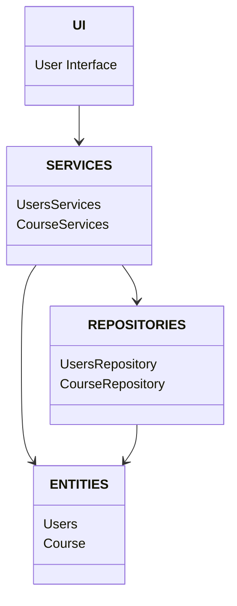
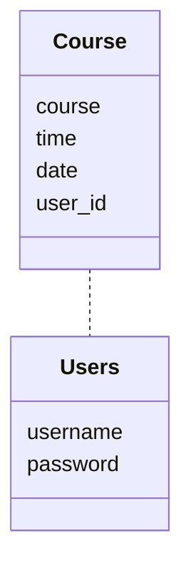
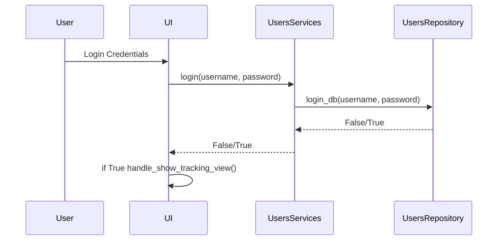
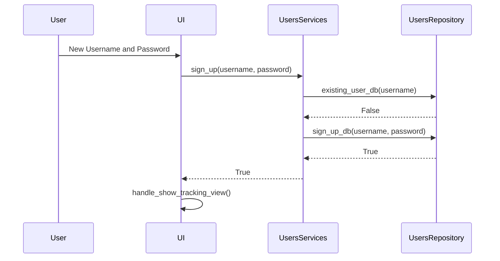
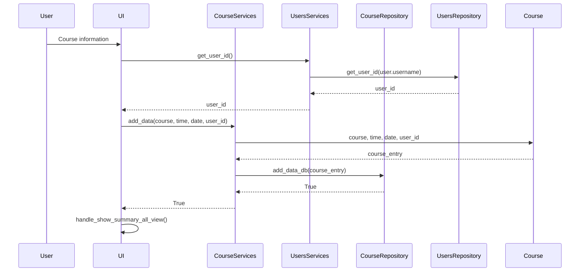
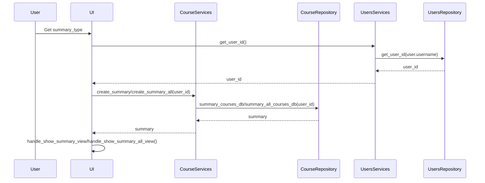

# Arkkitehtuurikuvaus

## Rakenne

Ohjelman pakkausrakenne on kuvattu alla olevassa kuvassa ja sen pakkaukset sisältävät seuraavat toiminnallisuudet
- UI sisältää käyttöliittymän
- Services sisältää sovelluslogiikan
- Repositories sisältää tiedon tallennuksen tietokantoihin
- Entities sisältää käyttäjän tai kurssin yksittäiset ilmentymät




## Käyttöliittymä

Käyttöliittymä on rakennettu tkinter kirjastolla ja se sisältää viisi erilaista näkymää:

- Sisäänkirjautuminen


- Uuden käyttäjätunnuksen luominen


- Päätoiminnallisuus jossa tietoa voi lisätä


- Koostenäkymä yhteenlasketuista tunneista


- Yhteenveto kaikista käyttäjän tekemistä merkinnöistä


## Sovelluslogiikka

Sovelluksessa on kaksi luokkaa jotka kuvaavat rekisteröityneitä käyttäjiä tai käyttäjän syöttämiä kurssin tietoja.




## Tiedon tallennus

Pakkausrakenteen repositories -luokissa toteutetaan tiedon tallennus SQLite tietokantaan. ```UsersRepository``` -luokka vastaa käyttäjätunnuksiin liittyvistä tiedon tallentamisesta ja hakemisesta tietokantaan. ```CourseRepository``` -luokka vastaa kurssien suorittamiseen liittyvien tietojen tallentamisesta ja hakemisesta tietokannasta. Tietokanta on laajennettavissa jos uusia ominaisuuksia halutaan lisätä ohjelmaan.

Tiedot tallennetaan db.db tiedostoon. Sovelluksen testaamisessa on erikseen määritetty käytettäväksi test.db tiedostoa.

Käyttäjätunnusten tallennukseen käytetään ```users``` -taulussa seuraavanlaista rakennetta. Id on käyttäjän yksilöivä numero, username on käyttäjän valitsema käyttäjätunnus ja password käyttäjän valitsema salasana.

        id INTEGER PRIMARY KEY,
        username TEXT UNIQUE,
        password TEXT

Kurssin suorituksiin liittyvien tietojen tallentamiseen käytetään ```courses``` -taulussa seuraavanlaista rekennetta. Id on kurssin suorituksen merkinnän yksilöivä numero, course on käyttäjän syöttämä kurssin tunniste, time on käyttäjän syöttämä kurssiin käytetty aika, date on tapahtuman päivämäärä ja user_id viittaa näiden tietojen syöttäneen käyttäjän yksilöivään tunnisteeseen.

        id INTEGER PRIMARY KEY,
        course TEXT,
        time INTEGER,
        date TEXT,
        user_id INTEGER REFERENCES users


## Päätoiminnallisuudet

### Sisäänkirjautuminen

Jos käyttäjällä on jo olemassa olevat tunnukset, syöttää hän ne graafisen käyttöliittymän sisäänkirjautumis ikkunaan. Tämän jälkeen sovellus noudattaa seuraavanlaista toimintaa:



Käyttöliittymä kutsuu ```UsersServices``` sisällä olevaa login metodia parametreina käyttäjän syöttämä käyttäjätunnus ja salasana. Tämän jälkeen kutsutaan ```UsersRepository```:n sisällä olevaa metodia login_db jolle annetaan edelleen samat käyttäjän syöttämä käyttäjätunnus ja salasana. Tämän jälkeen login_db metodi tarkistaa löytyykö tämän niminen käyttäjä tietokannan ```users``` -taulusta. Jos käyttäjää ei löydy tai salasana on väärä palauttaa login_db metodi False. Jos tunnus ja salasana vastaavat tietokannasta löytyvää tietoa palauttaa metodi True. Onnistuneen sisäänkirjautumisen johdosta käyttöliittymän näkymä vaihdetaan päänäkymään. Jos kirjautumistiedot eivät ole oiken saa käyttäjä siitä virheilmoituksen sisäänkirjautumisnäkymässä.

### Uuden käyttäjän luominen

Jos käyttäjällä ei ole olemassa tunnuksia, syöttää hän ne graafisen käyttöliittymän ikkunaan joka on tarkoitettu uusien tunnusten luomiseen. Tämän jälkeen sovellus noudattaa seuraavanlaista toimintaa:



Käyttöliittymä kutsuu ```UsersServices``` sisällä olevaa sign_up metodia parametreina käyttäjän syöttämä uusi käyttäjätunnus ja salasana. Tämän jälkeen kutsutaan ```UsersRepository```:n sisällä olevaa metodia sign_up_db jolle annetaan edelleen samat käyttäjän syöttämä uusi käyttäjätunnus ja salasana. Tämän jälkeen sign_up_db metodi tarkistaa löytyykö tämän niminen käyttäjä tietokannan ```users``` -taulusta. Jos tämän nimistä käyttäjää ei vielä ole olemassa, tallennetaan tiedot kyseiseen tauluun tietokantaan ja metodi palauttaa True. Jos tämän nimiminen käyttäjä jo löytyy palauttaa metodi False. Onnistuneen käyttäjätunnuksen luomisen jälkeen ohjelma kirjaa uuden käyttäjän automaattisesti sisään ja käyttöliittymän näkymä vaihdetaan päänäkymään. Jos käyttäjätunnus sattuisi jo olemaan käytössä saa käyttäjä siitä geneerisen virheilmoituksen. Tämä estää myös osakseen jo olemassa olevien käyttäjätunnusten kalastelemisen tietokannasta.

### Kurssiin käytetyn ajan lisääminen

Käyttäjä syöttää ohjelman käyttöliittymän päänäkymään tietoja joilla hän voi pitää kirjaa kursseihin käytetystä työajasta. Käyttäjä syöttää kurssin tunnisteen, tuntimäärän jota työhön on käytetty ja päivämäärän jolloin työ on tehty. Tämän jälkeen sovellus noudattaa seuraavanlaista toimintaa:


Käyttöliittymä kutsuu ```UsersServices``` sisällä olevaa get_user_id metodia hakeakseen käyttäjän ysilöivät id-numeron, jotta tietokantaan syötettävästä tiedosta saadaan myöhemmin käyttäjäkohtainen. Tämän jälkeen kutsutaan ```UsersRepository```:n sisällä olevaa metodia get_user_id jolle annetaan parametrina käyttäjän sisäänkirjautumisen yhteydessä tallennettu user olion sisältämä username. Käyttäjän yksilöivä id-numero haetaan tietokannasta ```users``` -taulusta ja palautetaan käyttöliittymälle. Käyttöliittymä kutsuu ```CourseServices``` sisällä olevaa add_data metodia parametreina käyttäjän syöttämä kurssin tunnus, käytetty aika, päivämäärä ja aikaisemin haettu käyttäjän yksilöivä id-numero. Tämän jälkeen samat tiedot välitetään ```Course``` luokalle joka tekee kurssista yksittäisen ilmentymän. Ilmentymä palautetaan course_entry muodossa ```CourseServices``` -luokalle. Course_entry -olio lähetetään nyt ```UsersRepository```:n sisällä olevaan metodiin add_data_db joka lisää tiedot tietokannan ```courses``` -tauluun. Onnistuneen lisäyksen päätteeksi käyttöliittymä vaihdetaan näkymään, jossa käyttäjä näkee kaikki sen hetkiset syöttämänsä tiedot.


### Koosteen luominen

Käyttäjä voi päänäkymästä luoda kaksi erilaista koostetta. Näytä kooste -painikkeesta käyttäjä näkee yhteenvedon jossa esitetään kurssin tunnus ja siihen käytetty aika (summary). Jos samalla kurssin tunnuksella löytyy tietokannasta useita merkintöjä laskee ohjelma ne yhteen ja esittää summatun ajankäytön käyttäjälle. Näytä kaikki merkinnät -painikkeesta käyttäjä näkee kaikki sen hetkiset syöttämänsä tiedot (summary_all). Tämä näkymä on sama, johon käyttäjä päätyy syötettyään ohjelmaan kurssin tietoja onnistuneesti. Sovellus noudattaa molemmissa koosteissa seuraavanlaista toimintaa:


Käyttöliittymä kutsuu ```UsersServices``` sisällä olevaa get_user_id metodia hakeakseen käyttäjän ysilöivät id-numeron, jotta tietokannasta myöhemmin haettava tieto on käyttäjän itsensä syöttämää. Tämän jälkeen kutsutaan ```UsersRepository```:n sisällä olevaa metodia get_user_id jolle annetaan parametrina käyttäjän sisäänkirjautumisen yhteydessä tallennettu user olion sisältämä username. Käyttäjän yksilöivä id-numero haetaan tietokannasta ```users``` -taulusta ja palautetaan käyttöliittymälle. Käyttöliittymä kutsuu ```CourseServices``` sisällä olevaa create_summay tai create_summary_all -metodia riippuen siitä, kumman koosteen käyttäjä on valinnut, parametrinaan käyttäjä yksilöivä id-numero. Tämän jälkeen kutsutaan ```CourseRepository```:n sisällä olevaa metodia summary_courses_db tai summary_all_courses_db parametrina käyttäjän yksilöivä id-numero. Kooste haetaan tietokannan taulusta ```courses```. Tässä vaiheessa palautettavan summary tiedon sisältö riippuu siitä kumman koosteen käyttäjä on valinnut. Summary sisältää kurssin tunnisteen sekä tunteihin käytetyn ajan summan, jos merkintöjä samalla kurssitunnisteella on tehty useampia. Summary_all sisältää kaikki käyttäjän syöttämät tiedot eli kurssin tunnisteen, kurssiin käytetyn yksilöllisen ajan ja työn päivämäärän. Tämän jälkeen käyttöliittymä esittää käyttäjän valitseman yhteenveto näkymän tai kaikkien syötteiden näkymän.