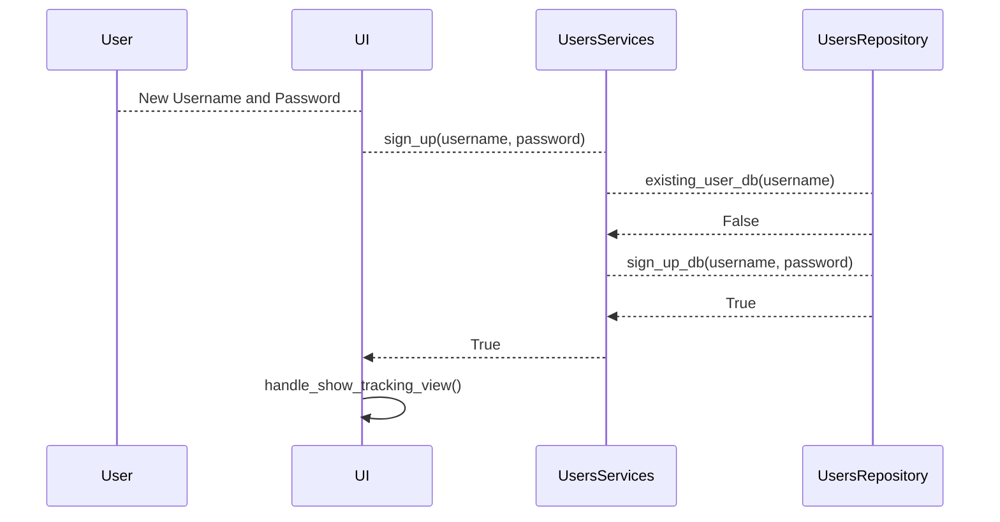

# Arkkitehtuurikuvaus

## Rakenne

Ohjelman pakkausrakenne on kuvattu alla olevassa kuvassa ja sen pakkaukset sisältävät seuraavat toiminnallisuudet
- UI sisältää käyttöliittymän
- Services sisältää sovelluslogiikan
- Repositories sisältää tiedon tallennuksen tietokantoihin


## Käyttöliittymä

Käyttöliittymä on rakennettu tkinter kirjastolla ja se sisältää neljä erilaista näkymää:

- Sisäänkirjautuminen


- Uuden käyttäjätunnuksen luominen


- Päätoiminnallisuus jossa tietoa voi lisätä


- Koostenäkymä

*Tulossa*

## Tiedon tallennus

Pakkausrakenteen repositories -luokissa toteutetaan tiedon tallennus SQLite tietokantaan. ```UsersRepository``` -luokka vastaa käyttäjätunnuksiin liittyvistä tiedon tallentamisesta ja hakemisesta tietokantaan. ```CourseRepository``` -luokka vastaa kurssien suorittamiseen liittyvien tietojen tallentamisesta ja hakemisesta tietokannasta. Tietokanta on laajennettavissa jos uusia ominaisuuksia halutaan lisätä ohjelmaan.

Tiedot tallennetaan db.db tiedostoon. Sovelluksen testaamisessa on erikseen määritetty käytettäväksi test.db tiedostoa.

Käyttäjätunnusten tallennukseen käytetään ```users``` -taulussa seuraavanlaista rakennetta. Id on käyttäjän yksilöivä numero, username on käyttäjän valitsema käyttäjätunnus ja password käyttäjän valitsema salasana.

        id INTEGER PRIMARY KEY,
        username TEXT UNIQUE,
        password TEXT

Kurssin suorituksiin liittyvien tietojen tallentamiseen käytetään ```courses``` -taulussa seuraavanlaista rekennetta. Id on kurssin suorituksen merkinnän yksilöivä numero, course on käyttäjän syöttämä kurssin tunniste, time on käyttäjän syöttämä kurssiin käytetty aika, date on tapahtuman päivämäärä ja user_id viittaa näiden tietojen syöttäneen käyttäjän yksilöivään tunnisteeseen.

        id INTEGER PRIMARY KEY,
        course TEXT,
        time INTEGER,
        date TEXT,
        user_id INTEGER REFERENCES users


## Päätoiminnallisuudet

### Sisäänkirjautuminen


### Uuden käyttäjän luominen



### Tietojen lisääminen

### Koosteen luominen