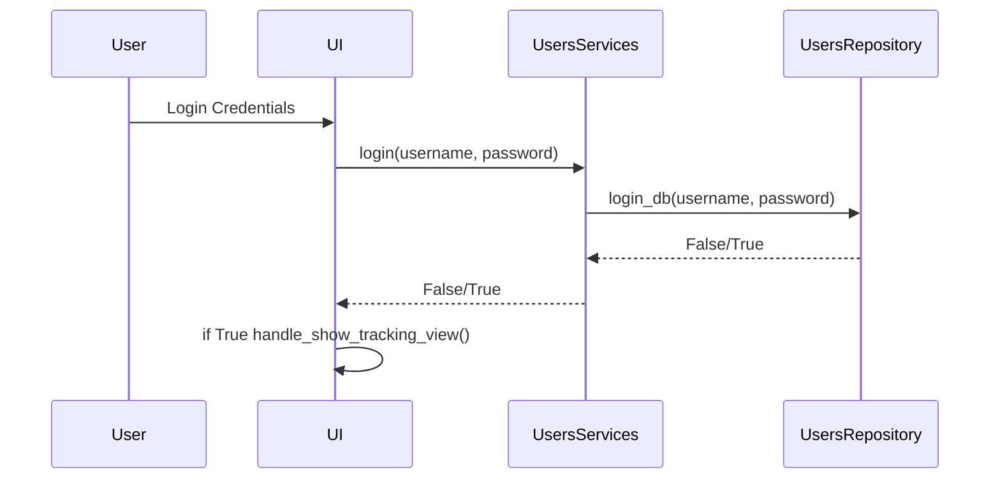
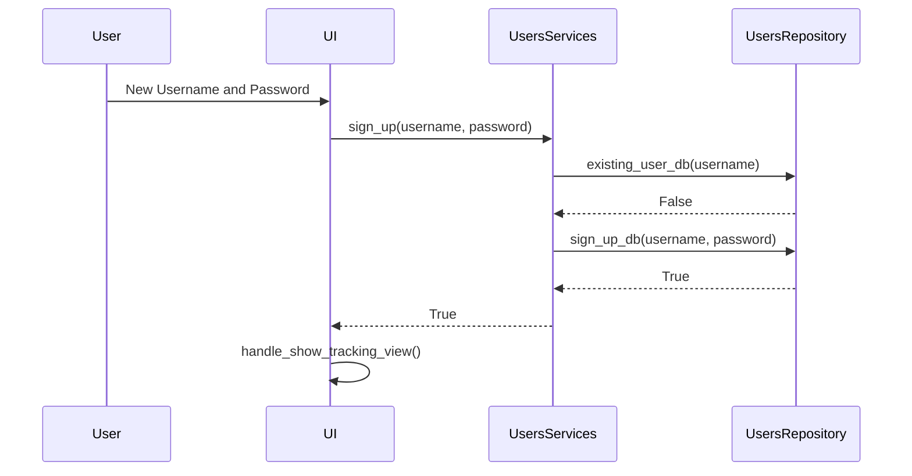
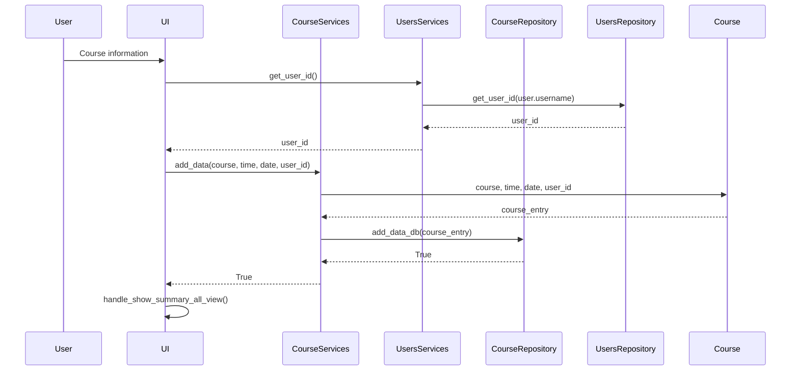

# Arkkitehtuurikuvaus

## Rakenne

Ohjelman pakkausrakenne on kuvattu alla olevassa kuvassa ja sen pakkaukset sisältävät seuraavat toiminnallisuudet
- UI sisältää käyttöliittymän
- Services sisältää sovelluslogiikan
- Repositories sisältää tiedon tallennuksen tietokantoihin


## Käyttöliittymä

Käyttöliittymä on rakennettu tkinter kirjastolla ja se sisältää neljä erilaista näkymää:

- Sisäänkirjautuminen


- Uuden käyttäjätunnuksen luominen


- Päätoiminnallisuus jossa tietoa voi lisätä


- Koostenäkymä

*Tulossa*

## Tiedon tallennus

Pakkausrakenteen repositories -luokissa toteutetaan tiedon tallennus SQLite tietokantaan. ```UsersRepository``` -luokka vastaa käyttäjätunnuksiin liittyvistä tiedon tallentamisesta ja hakemisesta tietokantaan. ```CourseRepository``` -luokka vastaa kurssien suorittamiseen liittyvien tietojen tallentamisesta ja hakemisesta tietokannasta. Tietokanta on laajennettavissa jos uusia ominaisuuksia halutaan lisätä ohjelmaan.

Tiedot tallennetaan db.db tiedostoon. Sovelluksen testaamisessa on erikseen määritetty käytettäväksi test.db tiedostoa.

Käyttäjätunnusten tallennukseen käytetään ```users``` -taulussa seuraavanlaista rakennetta. Id on käyttäjän yksilöivä numero, username on käyttäjän valitsema käyttäjätunnus ja password käyttäjän valitsema salasana.

        id INTEGER PRIMARY KEY,
        username TEXT UNIQUE,
        password TEXT

Kurssin suorituksiin liittyvien tietojen tallentamiseen käytetään ```courses``` -taulussa seuraavanlaista rekennetta. Id on kurssin suorituksen merkinnän yksilöivä numero, course on käyttäjän syöttämä kurssin tunniste, time on käyttäjän syöttämä kurssiin käytetty aika, date on tapahtuman päivämäärä ja user_id viittaa näiden tietojen syöttäneen käyttäjän yksilöivään tunnisteeseen.

        id INTEGER PRIMARY KEY,
        course TEXT,
        time INTEGER,
        date TEXT,
        user_id INTEGER REFERENCES users


## Päätoiminnallisuudet

### Sisäänkirjautuminen

Jos käyttäjällä on jo olemassa olevat tunnukset, syöttää hän ne graafisen käyttöliittymän sisäänkirjautumis ikkunaan. Tämän jälkeen sovellus noudattaa seuraavanlaista toimintaa:



Käyttöliittymä kutsuu ```UsersServices``` sisällä olevaa login metodia parametreina käyttäjän syöttämä käyttäjätunnus ja salasana. Tämän jälkeen kutsutaan ```UsersRepository```:n sisällä olevaa metodia login_db jolle annetaan edelleen samat käyttäjän syöttämä käyttäjätunnus ja salasana. Tämän jälkeen login_db metodi tarkistaa löytyykö tämän niminen käyttäjä tietokannan ```users``` -taulusta. Jos käyttäjää ei löydy tai salasana on väärä palauttaa login_db metodi False. Jos tunnus ja salasana vastaavat tietokannasta löytyvää tietoa palauttaa metodi True. Onnistuneen sisäänkirjautumisen johdosta käyttöliittymän näkymä vaihdetaan päänäkymään. Jos kirjautumistiedot eivät ole oiken saa käyttäjä siitä virheilmoituksen sisäänkirjautumisnäkymässä.

### Uuden käyttäjän luominen

Jos käyttäjällä ei ole olemassa tunnuksia, syöttää hän ne graafisen käyttöliittymän ikkunaan joka on tarkoitettu uusien tunnusten luomiseen. Tämän jälkeen sovellus noudattaa seuraavanlaista toimintaa:



Käyttöliittymä kutsuu ```UsersServices``` sisällä olevaa sign_up metodia parametreina käyttäjän syöttämä uusi käyttäjätunnus ja salasana. Tämän jälkeen kutsutaan ```UsersRepository```:n sisällä olevaa metodia sign_up_db jolle annetaan edelleen samat käyttäjän syöttämä uusi käyttäjätunnus ja salasana. Tämän jälkeen sign_up_db metodi tarkistaa löytyykö tämän niminen käyttäjä tietokannan ```users``` -taulusta. Jos tämän nimistä käyttäjää ei vielä ole olemassa, tallennetaan tiedot kyseiseen tauluun tietokantaan ja metodi palauttaa True. Jos tämän nimiminen käyttäjä jo löytyy palauttaa metodi False. Onnistuneen käyttäjätunnuksen luomisen jälkeen ohjelma kirjaa uuden käyttäjän automaattisesti sisään ja käyttöliittymän näkymä vaihdetaan päänäkymään. Jos käyttäjätunnus sattuisi jo olemaan käytössä saa käyttäjä siitä geneerisen virheilmoituksen. Tämä estää myös osakseen jo olemassa olevien käyttäjätunnusten kalastelemisen tietokannasta.

### Kurssiin käytetyn ajan lisääminen



### Koosteen luominen